# argocd-deployment

[](https://github.com/shahid-khaleel/argocd-deployment/actions/workflows/ci-cd.yml)
[](https://argo-cd.readthedocs.io/)
[](https://kubernetes.io/)
[](#how-it-works)
[](app/pom.xml)
[](app/Dockerfile)
[](LICENSE)

A sample full-stack Java (Spring Boot) app deployed end-to-end with a GitOps
workflow: **GitHub -> Docker Hub -> Argo CD -> Minikube**. It exists to
demonstrate a genuine, working GitOps loop — a real GitHub Actions pipeline
builds and pushes an image, rewrites the deployment manifest, and Argo CD
takes it from there, syncing and self-healing the cluster with no manual
`kubectl apply` in the loop.

## Table of contents

- [Executive summary](#executive-summary)
- [How it works](#how-it-works)
- [Repository layout](#repository-layout)
- [Technology stack](#technology-stack)
- [Prerequisites](#prerequisites)
- [Quick start](#quick-start)
- [Documentation index](#documentation-index)
- [Application details](#application-details)
- [Build instructions](#build-instructions)
- [Deployment steps (summary)](#deployment-steps-summary)
- [Troubleshooting](#troubleshooting)
- [Cleanup](#cleanup)
- [Screenshots](#screenshots)
- [Known Issues / Recommendations](#known-issues--recommendations)
- [Status & Roadmap](#status--roadmap)
- [License](#license)

## Executive summary

- **What it is:** a minimal Spring Boot app (login + version/health endpoints)
  used purely as a payload to exercise a complete CI -> GitOps -> CD pipeline.
- **What it proves:** a Git commit under `app/**` is enough, end to end, to
  get a new container image running in a Kubernetes cluster — with no human
  running `kubectl apply` or `docker push` by hand, and with drift correction
  if someone tries to change the cluster out-of-band.
- **What it's not:** a production reference architecture. Secrets are
  plaintext demo credentials on purpose (see [Known Issues](#known-issues--recommendations)),
  there's a single environment (no dev/staging/prod overlays), and the target
  cluster is local Minikube, not a managed/production Kubernetes service.

## How it works

```mermaid
flowchart LR
    A[Dev pushes to main<br/>app/** changes] --> B

    subgraph CI["GitHub Actions - ci-cd.yml"]
        direction LR
        B[Checkout] --> C[Set up JDK 21]
        C --> D[mvn clean package<br/>build + run tests]
        D --> E[Compute image tag<br/>git short SHA]
        E --> F[Docker Hub login]
        F --> G[Build & push image<br/>:sha and :latest]
        G --> H[Rewrite image tag in<br/>gitops/deployment.yaml]
        H --> I[Commit & push to main<br/>retry on race w/ concurrent pushes]
    end

    subgraph CD["Argo CD (running in Minikube)"]
        direction LR
        J[Detect diff on gitops/ path<br/>poll or webhook] --> K[Sync]
        K --> L[Apply manifests<br/>prune + selfHeal]
    end

    I -->|new commit on main| J
    L --> M[Rolling update of the<br/>gitops-demo Deployment]
```



This is the literal sequence of jobs/steps in
[`.github/workflows/ci-cd.yml`](.github/workflows/ci-cd.yml) on the CI side,
and the literal `syncPolicy` in
[`argocd-application.yaml`](argocd-application.yaml) on the CD side —
see [docs/CICD_WORKFLOW.md](docs/CICD_WORKFLOW.md) for the manual-script
alternative to the Actions path.

## Repository layout

```
argocd-deployment/
├── app/                        # Spring Boot backend + static login UI
│   ├── src/main/java/...       # REST controllers (auth, health/version)
│   ├── src/main/resources/     # application.yml, static/ (login page)
│   ├── Dockerfile              # multi-stage build (Maven -> JRE)
│   ├── pom.xml
│   └── README.md                # app-specific docs: endpoints, config, local run
├── gitops/                     # Manifests Argo CD watches (source of truth for the cluster)
│   ├── namespace.yaml
│   ├── configmap.yaml
│   ├── secret.yaml               # demo-only plaintext credentials, see gitops/README.md
│   ├── deployment.yaml
│   ├── service.yaml
│   ├── ingress.yaml              # optional
│   └── README.md                 # what each manifest does, how Argo CD consumes this dir
├── argocd-application.yaml     # Argo CD Application (applied once, manually)
├── .github/workflows/ci-cd.yml # GitHub Actions CI/CD (build, test, push image, update manifest)
├── scripts/release.sh|ps1      # manual build->push->update->commit script (Actions alternative)
├── docs/                       # detailed guides (full table below)
├── screenshots/                 # captures of the working pipeline
└── LICENSE                      # MIT
```

## Technology stack

Java 21 · Spring Boot 3 · Maven · HTML/CSS/JS · Docker · Docker Hub ·
Kubernetes · Minikube · Argo CD · GitHub Actions

## Prerequisites

| Tool | Used for | Check |
|---|---|---|
| Docker Desktop | building images, Minikube's driver | `docker --version` |
| Minikube | local Kubernetes cluster | `minikube version` |
| kubectl | talking to the cluster | `kubectl version --client` |
| Git | version control | `git --version` |
| A GitHub account | source + GitOps repo | — |
| A Docker Hub account | image registry | — |
| (Optional) Argo CD CLI | scripted sync/status | `argocd version --client` |
| (Optional) JDK 21 + Maven | building outside Docker | `java -version`, `mvn -v` |

You do **not** need a local JDK/Maven install — the Dockerfile builds the jar
inside a `maven:3.9-eclipse-temurin-21` build stage.

## Quick start

```bash
# 1. Build & smoke-test locally
docker build -t <dockerhub-user>/argocd-deployment:1.0.0 app
docker run -d --name gitops-demo -p 8080:8080 \
  -e DEMO_USERNAME=admin -e DEMO_PASSWORD=admin123 \
  -e APP_VERSION=1.0.0 -e WELCOME_MESSAGE="Welcome!" \
  <dockerhub-user>/argocd-deployment:1.0.0
curl http://localhost:8080/actuator/health
docker rm -f gitops-demo

# 2. Push the image
docker login
docker push <dockerhub-user>/argocd-deployment:1.0.0

# 3. Push this repo to GitHub
git remote add origin https://github.com/<github-user>/argocd-deployment.git
git add -A && git commit -m "Initial commit"
git push -u origin main

# 4. Stand up Minikube + Argo CD (see docs/ for full detail)
minikube start --driver=docker
minikube addons enable ingress   # needed for the app's Ingress to report Healthy
kubectl create namespace argocd
kubectl apply -n argocd -f https://raw.githubusercontent.com/argoproj/argo-cd/stable/manifests/install.yaml --server-side --force-conflicts
kubectl -n argocd port-forward svc/argocd-server 8081:443 &
kubectl -n argocd get secret argocd-initial-admin-secret -o jsonpath="{.data.password}" | base64 -d

# 5. Register the Argo CD Application and let it deploy the app
kubectl apply -f argocd-application.yaml
kubectl -n argocd get applications
kubectl -n gitops-demo get pods,svc

# 6. Open the app
kubectl -n gitops-demo port-forward svc/gitops-demo 8080:80
# browse http://localhost:8080, log in with admin / admin123
```

## Documentation index

| Guide | Covers |
|---|---|
| [docs/MINIKUBE_SETUP.md](docs/MINIKUBE_SETUP.md) | Installing & starting Minikube, enabling the Ingress addon, troubleshooting |
| [docs/ARGOCD_SETUP.md](docs/ARGOCD_SETUP.md) | Installing Argo CD, exposing the UI, admin password, CLI login |
| [docs/DEPLOYMENT_GUIDE.md](docs/DEPLOYMENT_GUIDE.md) | Full step-by-step: image -> Application -> sync -> proving auto-update & self-heal |
| [docs/CICD_WORKFLOW.md](docs/CICD_WORKFLOW.md) | GitHub Actions pipeline stage-by-stage, plus the manual release script alternative |
| [gitops/README.md](gitops/README.md) | What each manifest in `gitops/` does and how Argo CD's `syncPolicy` consumes the directory |
| [app/README.md](app/README.md) | The Spring Boot app itself: endpoints, config sources, running/testing it standalone |
| [screenshots/README.md](screenshots/README.md) | Suggested capture list for the pipeline in action |

## Application details

- **Backend:** Spring Boot 3 / Java 21, Maven build.
- **Auth:** `POST /api/auth/login` — dummy check against credentials sourced
  from the Kubernetes `Secret` (`DEMO_USERNAME`/`DEMO_PASSWORD`, default
  `admin` / `admin123`).
- **Health:** `GET /actuator/health` (+ `/actuator/health/liveness` and
  `/actuator/health/readiness`, wired to the Deployment's probes).
- **Version/config demo:** `GET /api/version` returns `APP_VERSION` and
  `WELCOME_MESSAGE` from the `ConfigMap`, plus the serving pod's hostname —
  handy for proving a GitOps config change (or a rolling image update across
  replicas) took effect.
- **Logging:** a request-logging filter logs method/path/status/duration for
  every request; app startup/auth events are also logged (see
  `RequestLoggingFilter`, `AuthController`).
- **Frontend:** a single static login page (`app/src/main/resources/static/`)
  served directly by Spring Boot — no separate frontend container needed.

## Build instructions

```bash
# via Docker (no local JDK/Maven needed)
docker build -t <dockerhub-user>/argocd-deployment:<version> app

# or locally, if you have JDK 21 + Maven installed
cd app
mvn clean package
java -jar target/gitops-demo.jar
```

## Deployment steps (summary)

See [docs/DEPLOYMENT_GUIDE.md](docs/DEPLOYMENT_GUIDE.md) for the full walkthrough. In short:

1. Build & push the image to Docker Hub.
2. Push this repo to GitHub (source + `gitops/` manifests together).
3. Install Minikube + Argo CD, expose the Argo CD UI, grab the admin password.
4. `kubectl apply -f argocd-application.yaml` (one-time bootstrap).
5. Argo CD auto-syncs `gitops/` into the `gitops-demo` namespace.
6. Prove the loop: edit a manifest (or run `scripts/release.sh`/`.ps1` for a
   new image), commit, push — Argo CD picks it up and reconciles the cluster
   automatically, self-healing any manual drift.

## Troubleshooting

Setup issues (build, install, first deploy):

| Symptom | Likely cause / fix |
|---|---|
| `docker build` fails downloading dependencies | No internet access from the build stage — check your network/proxy. |
| `docker push` fails: `push access denied, repository does not exist or may require authorization` | Not logged in to Docker Hub in this shell — run `docker login` (use an access token as the password, not your account password). |
| `kubectl apply` on the Argo CD install manifest fails: `metadata.annotations: Too long` | The `applicationsets.argoproj.io` CRD is too large for client-side apply's annotation. Use `kubectl apply --server-side --force-conflicts` instead (see [docs/ARGOCD_SETUP.md](docs/ARGOCD_SETUP.md)). |
| Argo CD app stuck `Progressing` forever, never `Healthy` — even though pods show `2/2 Ready` | The `Ingress` has no address because `minikube addons enable ingress` was never run; Argo CD's health check waits on it indefinitely. Enable the addon (see [docs/MINIKUBE_SETUP.md](docs/MINIKUBE_SETUP.md)), or delete `gitops/ingress.yaml` if you don't need it. |
| Pods `CrashLoopBackOff` right after a fresh deploy, especially on a slow/resource-constrained machine | JVM cold start can take 40–50s under tight CPU limits — the default liveness probe (20s delay) can kill the pod mid-boot. `gitops/deployment.yaml` already ships a `startupProbe` (150s budget) to guard against exactly this; if you loosen resource limits or probe timings later, watch for this regressing. |
| Pods `ImagePullBackOff` | Image/tag doesn't exist on Docker Hub yet, or the repo is private — push it, or make the Docker Hub repo public. |
| Argo CD app stuck `OutOfSync` | Check `argocd app get gitops-demo` / `kubectl -n argocd describe application gitops-demo` for the diff; confirm the image tag in `gitops/deployment.yaml` actually exists on Docker Hub. |
| Login page loads but login fails | Confirm the `gitops-demo-secret` Secret's `DEMO_USERNAME`/`DEMO_PASSWORD` match what you're typing; check pod env with `kubectl -n gitops-demo exec deploy/gitops-demo -- env`. |
| ConfigMap edit doesn't show up in the app | ConfigMap changes don't restart pods automatically — run `kubectl -n gitops-demo rollout restart deployment gitops-demo`. |

Operational hiccups (things that happen while you're actively working with it):

| Symptom | Likely cause / fix |
|---|---|
| `kubectl port-forward` to the app or Argo CD UI suddenly refuses connections, or logs `lost connection to pod` | `port-forward` against a Service binds to one specific pod, not the Service itself — if that pod was replaced (rollout, restart, crash), the tunnel dies with it. Just re-run the same `port-forward` command; it'll pick up a current pod. This happens on every rollout, so expect it. |
| GitHub Actions fails at **Log in to Docker Hub** | `DOCKERHUB_USERNAME` / `DOCKERHUB_TOKEN` repo secrets aren't set — add them under **Settings → Secrets and variables → Actions** (see [docs/CICD_WORKFLOW.md](docs/CICD_WORKFLOW.md)). |
| GitHub Actions fails at **Commit and push updated manifest** with a non-fast-forward push error | `main` moved between checkout and push. The most common trigger is clicking **Re-run all jobs**, which replays against the *original* triggering commit rather than current `main`, so any commit that landed afterward creates a race. The workflow re-fetches and resets to `origin/main` before writing the manifest and retries the push up to 5 times, so this should self-heal — if it still fails after retries, something is pushing to `main` faster than the job can keep up (very unlikely outside heavy concurrent automation). |
| `git push` to the repo rejected (manually, outside CI) | Pull/rebase first (`git pull --rebase`) — the CI workflow or a teammate likely pushed a manifest update in the meantime. |

## Cleanup

```bash
# Stop any kubectl port-forward tunnels you have running
# (Ctrl+C in their terminal, or on Windows/Git Bash: pkill -f "port-forward")

# Remove the Argo CD-managed app + its namespace
kubectl delete -f argocd-application.yaml
kubectl delete namespace gitops-demo

# Remove the ingress addon's namespace (optional, if you enabled it)
kubectl delete namespace ingress-nginx

# Remove Argo CD itself
kubectl delete namespace argocd

# Tear down the whole local cluster
minikube stop
minikube delete

# Local Docker image cleanup (adjust tags to whatever you actually built)
docker images shahid9741/argocd-deployment --format "{{.Repository}}:{{.Tag}}" | xargs -r docker rmi
```

Deleting `gitops-demo`/`argocd`/`ingress-nginx` and running `minikube delete`
only touches this project's cluster resources — it doesn't affect any other
Docker containers or images unrelated to this repo running on the same
machine.

## Screenshots

See [screenshots/](screenshots/) for captures of: the Spring Boot app running,
the login UI, Docker Hub with the published image, `kubectl get pods,svc` in
Minikube, Argo CD pods running, the Argo CD Application in **Healthy**/**Synced**
state, and a successful redeploy triggered by a Git commit.

## Known Issues / Recommendations

Real findings from reviewing the current pipeline and manifests — not a
generic checklist:

- **Plaintext demo credentials in `gitops/secret.yaml`.** Already called out
  in-file: this repo commits `stringData` in the clear on purpose, to
  demonstrate the Secret -> Deployment wiring simply. Anyone adapting this
  repo for a real environment should switch to Sealed Secrets, SOPS, or
  External Secrets Operator before putting real credentials in it — plain
  Kubernetes `Secret` objects are only base64-encoded, not encrypted, both in
  Git and at rest in etcd.
- **CI secrets are handled correctly.** `ci-cd.yml` sources `DOCKERHUB_USERNAME`
  / `DOCKERHUB_TOKEN` exclusively from `${{ secrets.* }}` — no hardcoded
  credentials found in the workflow or scripts.
- **No image immutability / digest pinning.** `gitops/deployment.yaml` pins
  images by mutable tag (git short-SHA, e.g. `shahid9741/argocd-deployment:34772ad`)
  and CI also pushes a floating `:latest` tag. Short-SHA tags are effectively
  immutable in practice here (a new commit always gets a new SHA), but the
  Deployment doesn't pin by digest (`@sha256:...`), so nothing stops a
  `docker push --force`-style overwrite of an existing tag from silently
  changing what's running. Worth adding digest pinning if this pattern is
  reused somewhere with weaker registry guarantees.
- **No image scanning in CI.** The pipeline builds and pushes without a
  vulnerability scan (e.g. Trivy/Grype) or SBOM generation step. Fine for a
  demo; a gap if this became a real service.
- **Single environment, no overlays.** `gitops/` is a flat manifest set for
  one namespace/cluster — there's no Kustomize/Helm layering for dev/staging/prod.
  Reasonable for a demo scoped to Minikube; would need restructuring to
  support multiple environments.
- **Test coverage is a context-load smoke test only** (`GitopsDemoApplicationTests`).
  CI does run `mvn clean package`, which executes it, but there's no
  controller-level test coverage for `/api/auth/login` or `/api/version`.
- **Rollback runbook:** not currently documented as an explicit "how to roll
  back" procedure. In practice, `git revert` on the manifest-updating commit
  (or `scripts/release.sh <previous-version>`) plus Argo CD's normal sync
  achieves it, but this isn't spelled out anywhere — worth adding to
  [docs/DEPLOYMENT_GUIDE.md](docs/DEPLOYMENT_GUIDE.md) if the pipeline is
  extended further.

## Status & Roadmap

**Working today:** the full loop in the diagram above — CI build/test/push,
manifest rewrite, Argo CD sync and self-heal — is real and has been exercised
through several tagged releases (see commit history: `1.0.0` -> `1.0.1` ->
`1.1.0`).

**Genuine gaps** (see [Known Issues](#known-issues--recommendations) for detail):
image scanning in CI, digest pinning, a written rollback runbook, and
controller-level test coverage. None of these block the demo; they're the
first things to add if this pattern were promoted beyond a portfolio piece.

## License

[MIT](LICENSE) — see the [LICENSE](LICENSE) file.
